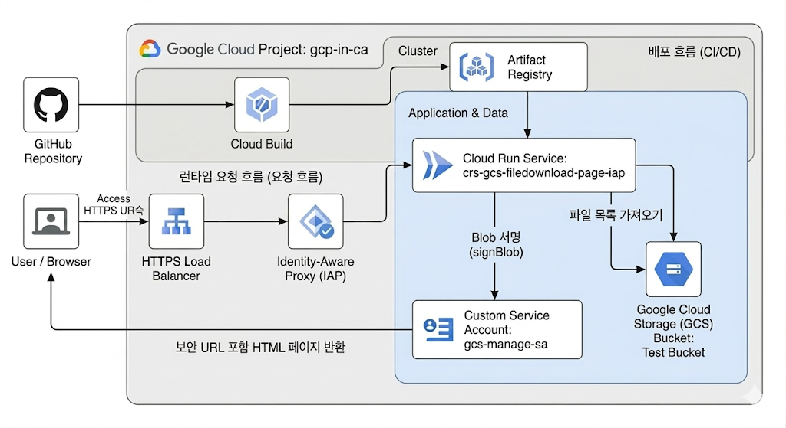

# GCS 파일 다운로드 웹 서비스 (Cloud Run)

Google Cloud Storage(GCS) 버킷의 파일 및 폴더를 탐색하고, Signed URL을 통해 안전하게 파일을 보거나 다운로드할 수 있는 웹 애플리케이션입니다. Google Cloud Run에 컨테이너 형태로 배포하여 서버리스 환경에서 손쉽게 운영할 수 있습니다.

## 아키텍쳐 구성 



## 주요 기능

-   GCS 버킷 내 파일/폴더 계층 구조 탐색
-   파일 미리보기 (브라우저에서 열기)를 위한 Signed URL 생성
-   파일 다운로드를 위한 Signed URL 생성
-   SPA(Single Page Application) 형태로 구현된 동적 프론트엔드

## 아키텍처

-   **Client (Browser)**: `public/` 디렉토리의 HTML, CSS, JavaScript 파일
-   **Backend (Cloud Run)**: Node.js/Express 기반 서버
    -   GCS API를 호출하여 파일 목록 조회
    -   파일 접근을 위한 v4 Signed URL 생성
-   **Storage**: Google Cloud Storage 버킷

## 배포 전 준비사항

1.  **Google Cloud SDK (gcloud CLI)**: 로컬 환경에 gcloud CLI를 설치하고 인증합니다.
    ```bash
    gcloud auth login
    gcloud config set project [YOUR_PROJECT_ID]
    ```

2.  **Docker**: 컨테이너 이미지를 빌드하기 위해 Docker를 설치합니다.

3.  **GCS Bucket**: 파일을 저장할 GCS 버킷을 생성합니다.

4.  **IAM 서비스 계정**: Cloud Run이 GCS에 접근하고 Signed URL을 생성하기 위해 사용할 서비스 계정을 생성하고 필요한 권한을 부여합니다.
    -   **필요 IAM 역할**:
        -   `Storage 개체 뷰어 (roles/storage.objectViewer)`: 버킷의 객체를 읽고 목록을 가져오기 위한 권한입니다.
        -   `서비스 계정 토큰 생성자 (roles/iam.serviceAccountTokenCreator)`: 서비스 계정 자체에 이 역할을 부여하여 v4 Signed URL을 생성할 수 있도록 합니다.

    ```bash
    # 서비스 계정 생성
    gcloud iam service-accounts create gcs-downloader-sa --display-name="GCS Downloader Service Account"

    # 서비스 계정에 권한 부여
    gcloud projects add-iam-policy-binding [YOUR_PROJECT_ID] \
      --member="serviceAccount:gcs-downloader-sa@[YOUR_PROJECT_ID].iam.gserviceaccount.com" \
      --role="roles/storage.objectViewer"

    gcloud iam service-accounts add-iam-policy-binding gcs-downloader-sa@[YOUR_PROJECT_ID].iam.gserviceaccount.com \
      --member="serviceAccount:gcs-downloader-sa@[YOUR_PROJECT_ID].iam.gserviceaccount.com" \
      --role="roles/iam.serviceAccountTokenCreator"
    ```

## 로컬 설정 및 파일 구성

배포를 진행하기 전에, 프로젝트 루트 디렉토리에 `package.json` 파일을 설치하고 `Dockerfile`을 생성해야 합니다.

### 1. `package.json` 의존성 설치

프로젝트에 `package.json` 파일이 있다면, 터미널에서 다음 명령어를 실행하여 의존성을 설치합니다.
```bash
npm install
```

### 2. `Dockerfile` 생성

Cloud Run에서 실행할 컨테이너 이미지를 빌드하기 위한 `Dockerfile`을 생성합니다.

```dockerfile
# Use an official Node.js runtime as a parent image
FROM node:18-slim

# Create and change to the app directory.
WORKDIR /usr/src/app

# Copy application dependency manifests to the container image.
# A wildcard is used to ensure both package.json AND package-lock.json are copied.
# Copying this first prevents re-running npm install on every code change.
COPY package*.json ./

# Install production dependencies.
RUN npm install --only=production

# Copy local code to the container image.
COPY . .

# The service listens on port 8080, which is the default for Cloud Run.
# You can use the PORT environment variable to change this.
ENV PORT 8080

# Run the web service on container startup.
CMD [ "npm", "start" ]
```

## Cloud Run 배포 방법

### 1. Artifact Registry 저장소 생성

Docker 이미지를 저장할 Artifact Registry 저장소를 생성합니다. (이미 있는 경우 생략)

```bash
gcloud artifacts repositories create gcs-file-repo \
    --repository-format=docker \
    --location=asia-northeast3 \
    --description="Docker repository for GCS file download app"
```

### 2. Docker 인증

Artifact Registry에 이미지를 Push할 수 있도록 Docker 클라이언트를 인증합니다.

```bash
gcloud auth configure-docker asia-northeast3-docker.pkg.dev
```

### 3. Docker 이미지 빌드 및 Push

`Dockerfile`을 사용하여 이미지를 빌드하고 Artifact Registry에 Push합니다.

```bash
# 변수 설정
export PROJECT_ID=$(gcloud config get-value project)
export REPO_NAME=gcs-file-repo
export IMAGE_NAME=gcs-file-downloader
export REGION=asia-northeast3
export IMAGE_TAG=${REGION}-docker.pkg.dev/${PROJECT_ID}/${REPO_NAME}/${IMAGE_NAME}:latest

# 이미지 빌드
docker build -t ${IMAGE_TAG} .

# 이미지 Push
docker push ${IMAGE_TAG}
```

### 4. Cloud Run 서비스 배포

Push한 이미지를 사용하여 Cloud Run 서비스를 배포합니다.

-   `[YOUR_BUCKET_NAME]`: 준비사항에서 생성한 GCS 버킷 이름으로 변경하세요.
-   `[YOUR_SERVICE_ACCOUNT_EMAIL]`: 준비사항에서 생성한 서비스 계정 이메일로 변경하세요. (`gcs-downloader-sa@[YOUR_PROJECT_ID].iam.gserviceaccount.com`)

```bash
gcloud run deploy gcs-file-downloader-service \
  --image=${IMAGE_TAG} \
  --platform=managed \
  --region=${REGION} \
  --allow-unauthenticated \
  --set-env-vars="BUCKET_NAME=[YOUR_BUCKET_NAME]" \
  --service-account=[YOUR_SERVICE_ACCOUNT_EMAIL]
```

-   `--allow-unauthenticated`: 모든 사용자가 웹 페이지에 접근할 수 있도록 허용합니다. 내부용으로만 사용하려면 이 옵션을 제거하고 IAP(Identity-Aware Proxy) 설정을 고려하세요.

배포가 완료되면 출력된 서비스 URL로 접속하여 GCS 파일 목록을 확인할 수 있습니다.

