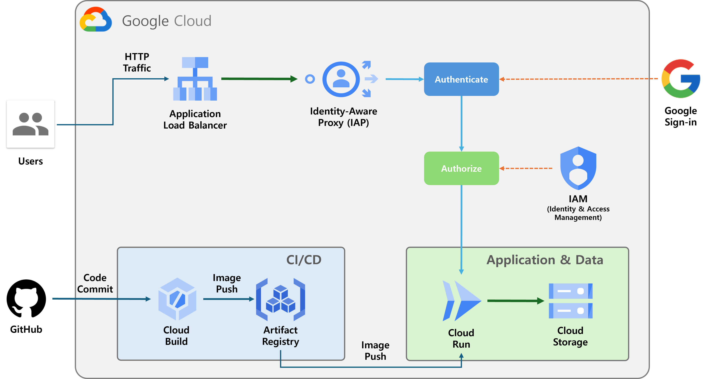

# GCS 파일 다운로드 웹 서비스 (Cloud Run + IAP)

Google Cloud Storage(GCS)의 허용된 여러 버킷 중 하나를 선택해 파일과 폴더를 탐색하고, v4 Signed URL을 통해 파일을 브라우저에서 열거나 다운로드할 수 있는 Node.js/Express 애플리케이션입니다. Cloud Run에 컨테이너로 배포하고, Application Load Balancer와 Identity-Aware Proxy(IAP)를 통해 인증된 사용자만 접근하는 구성을 전제로 합니다.

## 아키텍처 구성



사용자는 HTTP 트래픽으로 Application Load Balancer에 접근하고, IAP가 Google 계정 인증과 IAM 기반 권한 검사를 수행합니다. 인가된 요청만 Cloud Run 서비스로 전달되며, Cloud Run은 서비스 계정 권한으로 Cloud Storage 객체 목록을 조회하고 파일별 Signed URL을 생성합니다.

CI/CD 흐름은 코드 커밋 후 Cloud Build가 컨테이너 이미지를 빌드하고 Artifact Registry에 푸시한 뒤, 해당 이미지를 Cloud Run에 배포하는 방식입니다. `cloudbuild.yaml`은 이미지 빌드, 푸시, Cloud Run 배포까지 수행하며, Application Load Balancer, IAP, Serverless NEG, IAM 접근 정책은 별도로 구성해야 합니다.

## 주요 기능

- 환경변수 허용 목록에서 GCS 버킷 선택
- 선택한 버킷의 폴더/파일 계층 탐색
- 파일 미리보기용 v4 Signed URL 생성
- 파일 다운로드용 v4 Signed URL 생성
- 선택한 파일의 경로, 유형, 크기, 수정일 표시
- Application Load Balancer와 IAP를 통한 인증/인가 기반 접근
- Cloud Build, Artifact Registry, Cloud Run 배포 구성

## 파일 구성

- `index.js`: Express 서버 진입점입니다. `/api/buckets`에서 허용 버킷 목록을, `/api/files`에서 선택한 버킷의 객체 목록과 Signed URL을 반환합니다.
- `public/index.html`: GCS Explorer 화면의 HTML 구조입니다.
- `public/script.js`: 파일 목록 조회, breadcrumb 이동, 상세 패널 표시를 담당합니다.
- `public/style.css`: 화면 레이아웃과 테이블/상세 패널 스타일입니다.
- `public/favicon.png`: 브라우저 탭에 표시되는 favicon 이미지입니다.
- `Dockerfile`: Node.js 20 기반 Cloud Run 컨테이너 이미지를 빌드합니다.
- `cloudbuild.yaml`: Docker 이미지 빌드/푸시 후 Cloud Run에 배포하는 Cloud Build 설정입니다.
- `.dockerignore`: 컨테이너 빌드에서 제외할 파일 목록입니다.
- `image.png`: README에서 사용하는 아키텍처 이미지입니다.

## 동작 방식

1. 사용자가 Application Load Balancer 주소로 접속합니다.
2. IAP가 Google 계정 인증을 수행하고, IAM 정책에 따라 접근 권한을 확인합니다.
3. 권한이 있는 요청이 Cloud Run 서비스로 전달됩니다.
4. 브라우저가 `/api/buckets`에서 `BUCKET_NAMES` 환경변수에 명시된 허용 목록을 조회합니다.
5. 사용자가 버킷을 선택하면 브라우저가 `/api/files?bucket=...&path=...` API를 호출합니다.
6. 서버는 선택된 버킷이 허용 목록에 있는지 확인한 후 prefix/delimiter 방식으로 폴더와 파일을 조회합니다.
7. 서버가 각 파일에 대해 15분 동안 유효한 Signed URL을 생성하고 프론트엔드가 파일 목록과 상세 정보를 표시합니다.

## 배포 전 준비사항

### 1. Google Cloud SDK 인증

```bash
gcloud auth login
gcloud config set project [YOUR_PROJECT_ID]
```

### 2. GCS 버킷 생성

파일을 저장할 GCS 버킷을 준비합니다.

### 3. 서비스 계정 및 IAM 권한

Cloud Run이 GCS 객체를 조회하고 Signed URL을 생성할 수 있도록 실행 서비스 계정에 권한을 부여합니다.

필요한 역할:

- `roles/storage.objectViewer`: 버킷 객체 목록 조회 및 읽기
- `roles/iam.serviceAccountTokenCreator`: v4 Signed URL 서명 생성

```bash
gcloud iam service-accounts create gcs-manage-sa \
  --display-name="GCS Manage Service Account"

gcloud storage buckets add-iam-policy-binding gs://[BUCKET_A] \
  --member="serviceAccount:gcs-manage-sa@[YOUR_PROJECT_ID].iam.gserviceaccount.com" \
  --role="roles/storage.objectViewer"

gcloud storage buckets add-iam-policy-binding gs://[BUCKET_B] \
  --member="serviceAccount:gcs-manage-sa@[YOUR_PROJECT_ID].iam.gserviceaccount.com" \
  --role="roles/storage.objectViewer"

gcloud iam service-accounts add-iam-policy-binding \
  gcs-manage-sa@[YOUR_PROJECT_ID].iam.gserviceaccount.com \
  --member="serviceAccount:gcs-manage-sa@[YOUR_PROJECT_ID].iam.gserviceaccount.com" \
  --role="roles/iam.serviceAccountTokenCreator"
```

### 4. IAP 및 Load Balancer 구성

Cloud Run 서비스 앞단에 Application Load Balancer와 Serverless NEG를 구성하고, IAP를 활성화합니다. IAP 접근 대상 사용자 또는 그룹에는 IAP-secured Web App User 권한을 부여해야 합니다.

Cloud Run 배포 설정은 ingress를 `internal-and-cloud-load-balancing`으로 제한하고 `--allow-unauthenticated`를 사용합니다. 이 값은 Cloud Run 자체 인증을 끄고 Load Balancer/IAP 레이어에서 접근을 제어하기 위한 설정입니다. 외부에 직접 공개하는 구성으로 전환할 경우에는 HTTPS, 도메인, 인증, 접근 제어 정책을 별도로 재검토해야 합니다.

## 로컬 실행

Application Default Credentials가 GCS 접근 권한을 가진 계정으로 설정되어 있어야 합니다.

```bash
npm install
export BUCKET_NAMES="[BUCKET_A],[BUCKET_B],[BUCKET_C]"
npm start
```

Windows PowerShell에서는 다음처럼 환경변수를 설정합니다.

```powershell
npm install
$env:BUCKET_NAMES="[BUCKET_A],[BUCKET_B],[BUCKET_C]"
npm start
```

기본 포트는 `8080`입니다. 실행 후 `http://localhost:8080`으로 접속합니다.

## 수동 배포

### 1. Artifact Registry 저장소 생성

이미 저장소가 있다면 생략할 수 있습니다.

```bash
gcloud artifacts repositories create cloud-run-source-deploy \
  --repository-format=docker \
  --location=asia-northeast3 \
  --description="Docker repository for Cloud Run source deployments"
```

### 2. Docker 인증

```bash
gcloud auth configure-docker asia-northeast3-docker.pkg.dev
```

### 3. 이미지 빌드 및 푸시

```bash
export PROJECT_ID=$(gcloud config get-value project)
export REGION=asia-northeast3
export REPO_NAME=cloud-run-source-deploy
export IMAGE_NAME=gcs-filedownload-page-iap/crs-gcs-filedownload-page-iap
export IMAGE_TAG=${REGION}-docker.pkg.dev/${PROJECT_ID}/${REPO_NAME}/${IMAGE_NAME}:latest

docker build -t ${IMAGE_TAG} .
docker push ${IMAGE_TAG}
```

### 4. Cloud Run 배포

```bash
gcloud run deploy crs-gcs-filedownload-page-iap \
  --image=${IMAGE_TAG} \
  --platform=managed \
  --region=${REGION} \
  --ingress=internal-and-cloud-load-balancing \
  --allow-unauthenticated \
  --set-env-vars="^@^BUCKET_NAMES=[BUCKET_A],[BUCKET_B],[BUCKET_C]" \
  --service-account=[YOUR_SERVICE_ACCOUNT_EMAIL]
```

## Cloud Build 배포

`cloudbuild.yaml`은 다음 작업을 수행합니다.

1. Docker 이미지 빌드
2. Artifact Registry로 이미지 푸시
3. Cloud Run 서비스 배포

배포 전에 `cloudbuild.yaml`의 substitutions 값을 환경에 맞게 확인하세요.

- `_SERVICE_NAME`: Cloud Run 서비스 이름
- `_REGION`: Cloud Run 및 Artifact Registry 리전
- `_REPO_NAME`: Artifact Registry 저장소 이름
- `_IMAGE_NAME`: Artifact Registry에 저장될 이미지 경로와 이름
- `_BUCKET_NAMES`: 화면에 표시하고 조회를 허용할 GCS 버킷 이름 목록(쉼표 구분)
- `_SERVICE_ACCOUNT_EMAIL`: Cloud Run 실행 서비스 계정

현재 파일에는 다음 기본값이 들어 있습니다.

- `_SERVICE_NAME`: `crs-gcs-filedownload-page-iap`
- `_REGION`: `asia-northeast3`
- `_REPO_NAME`: `cloud-run-source-deploy`
- `_IMAGE_NAME`: `gcs-filedownload-page-iap/crs-gcs-filedownload-page-iap`
- `_BUCKET_NAMES`: `gcp-in-ca-test-bucket-wocheon07`
- `_SERVICE_ACCOUNT_EMAIL`: `gcs-manage-sa@gcp-in-ca.iam.gserviceaccount.com`

## 주의사항

- Signed URL은 현재 코드 기준 15분 동안 유효합니다.
- `BUCKET_NAMES` 환경변수는 쉼표로 구분하며, 목록에 없는 버킷을 API로 직접 지정하면 요청이 거부됩니다.
- 버킷 목록은 환경변수에서 제공하므로 실행 서비스 계정에 `storage.buckets.list` 권한은 필요하지 않습니다.
- 실행 서비스 계정은 `BUCKET_NAMES`에 지정한 각 버킷의 객체를 조회할 권한이 있어야 합니다.
- Application Load Balancer, IAP, Serverless NEG, IAP IAM 정책은 `cloudbuild.yaml`에서 생성하지 않으므로 별도로 구성해야 합니다.
- `--allow-unauthenticated`는 Cloud Run 직접 공개 목적이 아니라 IAP가 있는 Load Balancer 앞단 구성을 위한 설정으로 사용합니다.
